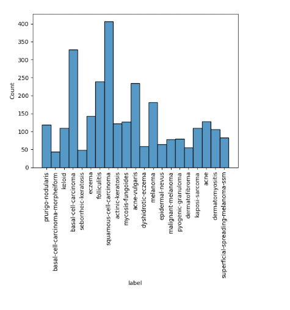
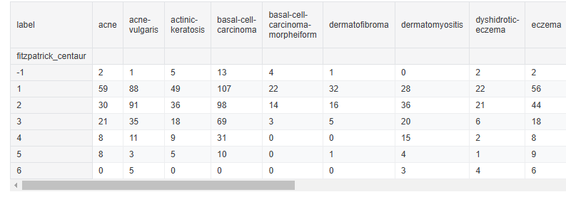
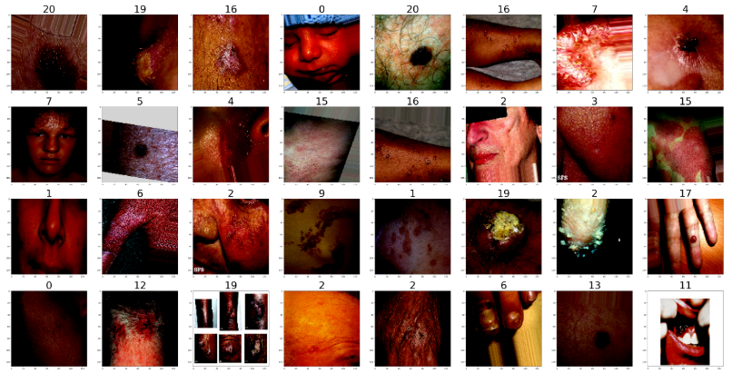

# AI for Dermatology Image Classification Project

## Team Members

- Millie Chen (https://github.com/2022mc12)
- Aleksandra Jacewicz (https://github.com/a-jacewicz)
- Imani Cage (https://github.com/Creasiion)
- Richa Chaudhary (https://github.com/richac123)
- David Vera (https://github.com/david-ver4)

---

## Project Overview

### Kaggle Competition and Break Through Tech AI Program

This project is part of a **Kaggle competition** that focuses on the classification of dermatological images. It is connected to the **Break Through Tech AI Program**, which is aimed at promoting diversity in the tech industry by providing opportunities for women, non-binary, and underrepresented tech students to work on intricate and cohesive AI projects. Our team leveraged the resources and mentorship provided by the program to tackle a real-world issue—dermatology image classification—while also learning more about AI applications and the usage and benefits of data exploration in healthcare.

### Objective of the Challenge

The challenge is to build a machine learning model to classify images of dermatological conditions into their corresponding categories. The model should predict the correct label for each image based on its visual features. The dataset includes a variety of skin conditions, ranging from common cosmetic issues to serious conditions like melanoma. Our model will be evaluated based on its **weighted average F1 score**, a metric that balances precision and recall.

### Real-World Significance and Potential Impact

The issues with dermatological diagnosis is often related to diversity of skin tones, which can affect the accuracy of machine learning models. By addressing this challenge, our work has the potential to:

- Improve early detection of skin cancer, especially melanoma, by developing more inclusive models.
- Increase the accessibility of dermatology services, particularly in underserved regions with limited access to specialists.
- Contribute to the ongoing effort to create AI-powered tools that can assist healthcare professionals in providing timely, accurate diagnoses.

The implications of this work are significant, as accurate and equitable AI-driven diagnostic tools could assist save lives and improve the quality of healthcare globally.

---

## Data Exploration

### Dataset Description

The dataset used in this project is a subset of the **FitzPatrick17k** dataset, which is a large collection of dermatological images. The dataset contains approximately **17,000 images** with a variety of dermatological conditions, including both serious conditions and cosmetic conditions, as well as a range of skin tones. The images are scored using the **FitzPatrick Skin Tone (FST) scale**, ensuring that the dataset includes a diverse representation of skin types.

For this competition, we used a subset of **4,500 images** from the full FitzPatrick17k dataset, which represents **21 skin conditions**. The goal was to create a more manageable classification problem while still addressing some of the representation issues observed in the larger dataset.

#### Evaluation Metric

The evaluation for this competition is based on the **weighted average F1 score**, which takes into account both precision and recall, ensuring a balanced assessment of model performance, particularly in imbalanced datasets.

### Dataset Sources

The images in this dataset were sourced from two reputable dermatology websites:

- **DermaAmin**
- **Atlas Dermatologico**

These sources provide a wide variety of dermatological images. 

### Data Dictionary

The dataset contains several important columns that describe each image and its metadata:

| Column                    | Data Type  | Description                                                                 |
|---------------------------|------------|-----------------------------------------------------------------------------|
| **md5hash**                | Object     | An alphanumeric hash serving as a unique identifier for each image.         |
| **fitzpatrick_scale**      | int64      | A self-reported score on the FitzPatrick Skin Tone scale (FST), ranging from [-1, 0) to [1, 6]. |
| **fitzpatrick_centaur**    | int64      | FST score assigned by Centaur Labs, a medical data annotation firm.        |
| **label**                  | Object     | The medical diagnosis of the skin condition (target for classification).    |
| **nine_partition_label**   | Object     | A label indicating one of nine diagnostic categories.                       |
| **three_partition_label**  | Object     | A label indicating one of three diagnostic categories.                      |
| **qc**                     | Object     | A quality control check by a Board-certified dermatologist (only for a subset of images). |
| **ddi_scale**              | int64      | A column used for dataset reconciliation purposes (may not be relevant).    |

### Dataset Exploration and Preprocessing
- The dataset consists of skin condition images with labels and metadata including skin type classifications
- Training dataset includes multiple features: image MD5 hash, Fitzpatrick scale ratings (self-reported and expert-annotated), skin condition labels, partitioned labels, and quality control indicators
- Images are organized in directories by skin condition

### Exploratory Analysis
- **Basic Statistics**: We examined dataset structure, data types, and checked for missing values
- **Class Distribution**: We identified significant imbalances in both skin conditions and skin types
- **Skin Type Analysis**: We compared self-reported (`fitzpatrick_scale`) and expert-annotated (`fitzpatrick_centaur`) skin type classifications and found that self-reported values were generally higher
- **Cross-tabulation**: We analyzed the relationship between skin types and conditions to identify underrepresented combinations

### Preprocessing Approach
1. **Path Handling**: We created standardized file paths by combining directory structures with image identifiers
2. **Data Augmentation**: To address class imbalance, we implemented image augmentation for underrepresented classes using:
   - Rotation (±20°)
   - Width/height shifts (±20%)
   - Zoom variation (±20%)
   - Horizontal flips
   - Brightness range (80-120%)
3. **Train-Validation Split**: We divided data into 80% training and 20% validation sets while preserving class distributions
4. **Image Processing**: Images were resized to 128×128 pixels and normalized using Xception's preprocessing function
5. **Data Generator**: We implemented efficient data loading with batch processing using Keras' ImageDataGenerator

## Exploratory Data Analysis Visualizations

